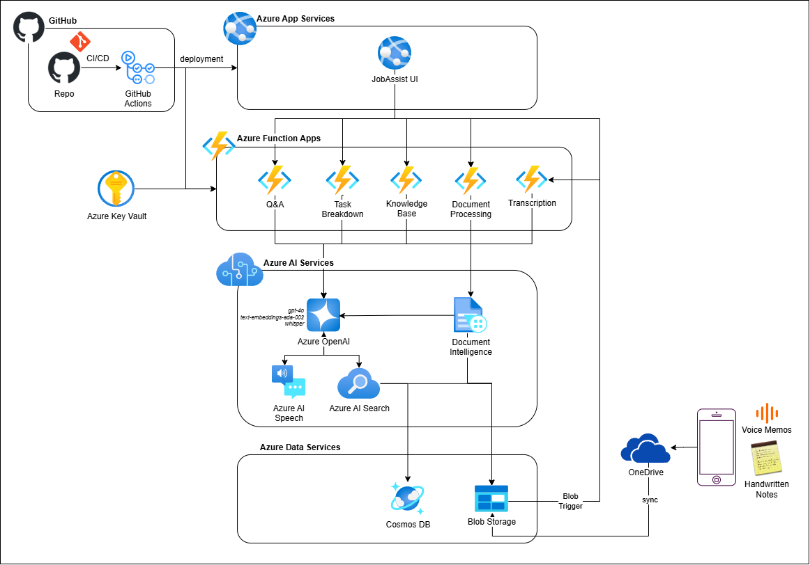
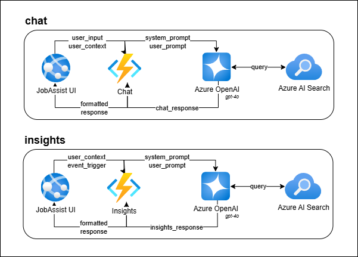
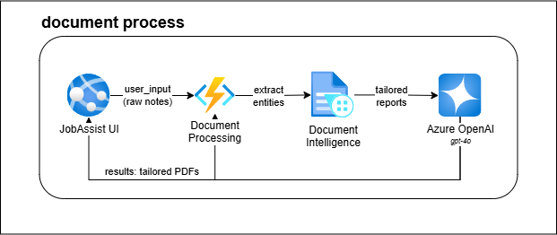
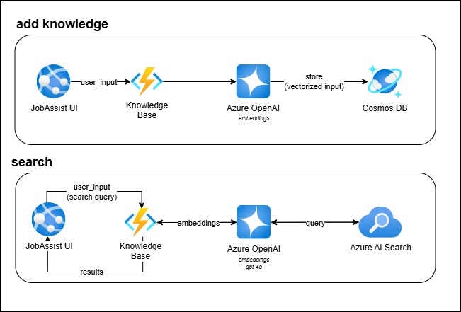
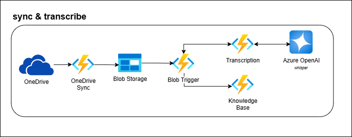
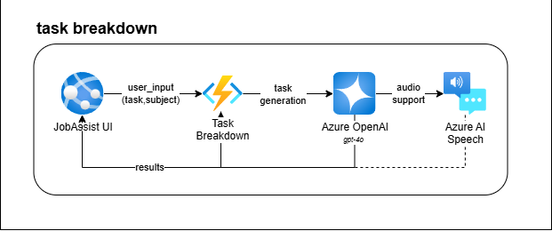

# JobAssistAI  
**Empowering Coaches, Transforming Lives**  

  
*Built for the Microsoft Innovation Challenge, March 2025*  

---

## 🚀 What is JobAssistAI?  

**JobAssistAI** is an innovative application crafted to enhance the productivity of job coaches in supported employment programs for individuals with disabilities, including those with intellectual, developmental, or physical challenges. Built entirely on **Microsoft Azure**, this solution optimizes workflows, delivers personalized support, and promotes independence for clients. 

By facilitating job matching in sectors such as retail, healthcare, IT, and manufacturing, automating report generation, and simplifying task breakdowns, JobAssistAI alleviates administrative burdens, enabling coaches to prioritize their core mission: empowering people.

Developed as part of the **Microsoft Innovation Challenge in March 2025**, this Flask-based application harnesses Azure's advanced AI and cloud capabilities to address pressing real-world challenges. JobAssistAI reflects a commitment to inclusion, transforming it from an aspiration into actionable impact.

---

## 📺 Demo & Presentation  

- 🎥 **Demo Video**: [Watch Here](https://drive.google.com/file/d/1WZBuEvlH_3rdswkA7YRR_qAmFrRFT0Tu/view?usp=sharing)  
- 📊 **Project Presentation (PPT)**: [View Slides](https://docs.google.com/presentation/d/1o8F_btWSaLwPV646AaUIfBHY35yIDM6E/edit?usp=sharing&ouid=112367915427564567168&rtpof=true&sd=true)  

---

## 🌟 The Problem We’re Solving  

Job coaches play a vital role, yet they face significant obstacles that hinder their effectiveness:  
- **Paperwork Overload:** Hours spent reformatting notes into reports for government agencies and employers.  
- **Personalized Guidance Gaps:** Crafting tailored task instructions for unique needs is slow and inconsistent.  
- **Lost Knowledge:** Insights vanish when coaches leave, leaving new hires scrambling.  
- **Bureaucratic Maze:** Navigating fragmented resources and guidelines steals time from coaching.

JobAssistAI redefines this landscape by automating repetitive tasks, centralizing expertise, and providing tailored support through a unified Azure-powered platform.

---

## ✨ Key Features  

### 1. AI Assistant  
- **What**: Real-time answers to compliance questions.  
- **How**: Azure AI Search and OpenAI analyze stored guidelines in Blob Storage.
- **Impact**: Minimizes administrative stress, keeping the focus on clients.

### 2. Centralized Knowledge Base  
- **What:** A comprehensive repository of strategies and contacts.  
- **How:** Coaches log insights into Azure Cosmos DB; Azure AI Search enables instant retrieval.  
- **Impact:** Preserves expertise, even as team members change.

### 3. Automated Documentation  
- **What:** Upload notes, receive polished reports.  
- **How:** Azure AI Document Intelligence extracts text, Azure OpenAI (GPT-4o) crafts HTML reports, and PDFs are stored in Blob Storage.  
- **Impact:** Reduces paperwork time significantly, freeing coaches for client advocacy.

### 4. Personalized Task Guidance  
- **What:** Detailed, step-by-step task guides customized for each client.  
- **How:** Azure OpenAI generates instructions; Azure Speech Services provides audio for accessibility.  
- **Impact:** Ensures consistent, client-specific support with minimal effort.

---

## 🛠️ Technical Architecture  

JobAssistAI integrates a robust set of Azure services with a Flask frontend:

- **Azure AI Document Intelligence**: Text extraction from notes.  
- **Azure OpenAI (GPT-4o)**: Report generation and task breakdowns.  
- **Azure OpenAI Embeddings Model**: Generates vector embeddings for text to enable semantic search and similarity matching in the knowledge base.  
- **Azure AI Whisper**: Speech-to-text transcription for converting voice insights into searchable text.  
- **Azure Blob Storage**: Secure file storage with versioning.  
- **Azure Cosmos DB**: Scalable knowledge base.  
- **Azure AI Search**: Rapid data retrieval.  
- **Azure Speech Services**: Text-to-speech for accessibility.  
- **Azure Functions**: Workflow automation.  
- **Azure Key Vault**: Secures sensitive credentials.

### System Architecture Diagrams

#### Overall System Architecture
The following diagram provides a high-level overview of JobAssist AI’s architecture:


#### Feature-Specific Architectures  
Below are detailed architecture diagrams for each key feature, illustrating their specific workflows:

- **AI Assistant**  
  This diagram shows how Azure AI Search and Azure OpenAI work together to provide real-time answers to compliance questions by analyzing guidelines stored in Blob Storage.  
  

- **Automated Documentation**  
  This diagram illustrates the flow of handwritten notes through Azure AI Document Intelligence for text extraction, Azure OpenAI (GPT-4o) for report generation, and Blob Storage for storing the final PDFs.  
  

- **Centralized Knowledge Base**  
  This diagram depicts how coaches log insights into Azure Cosmos DB, with Azure AI Search enabling instant retrieval for a comprehensive repository of strategies and contacts.  
  

- **Save Voice Insights**  
  This diagram outlines the process of transcribing audio files, categorizing insights, and saving them in Azure Cosmos DB for AI-powered searches, supporting formats like WAV, MP3, OGG, and FLAC.  
  

- **Personalized Task Guidance**  
  This diagram shows how Azure OpenAI generates step-by-step task instructions from user input, with Azure Speech Services providing audio output for accessibility.  
  

---

## 📂 Project Structure  
```
JobAssistAI/
├── azure-functions/                       # Azure Functions for AI features
│   ├── jobassistai-document-processing/   # Auto-generates reports from notes
│   ├── jobassistai-http-trigger-openai/   # OpenAI-powered responses
│   ├── jobassistai-http-trigger-tts/      # Text-to-speech for task guides
│   ├── jobassistai-save-insights/         # Saves insights in Azure Cosmos DB for AI-powered searches
│   ├── jobassistai-save-voice-insights/   # Transcribes audio files and saves insights to Cosmos DB
│   ├── jobassistai-search-insights/       # Converts natural language queries to embeddings and retrieves relevant information
├── docs/                                  # Documentation (Contains RAI impact assessment and system architecture diagrams)
├── onedrive/                              # OneDrive integration
├── static/                                # Frontend assets
│   ├── css/
│   └── js/
├── templates/                             # Flask HTML templates
│   ├── base.html
│   ├── consumer_detail.html
│   ├── dashboard.html
│   ├── knowledge_base.html
│   └── login.html
├── app.py                                 # Main Flask application
├── requirements.txt                       # Python dependencies
└── README.md                              # You’re here!
```

---

## 🔧 Azure Functions Deep Dive  

### `jobassistai-document-processing`  
- **Purpose**: Turns handwritten notes into polished PDFs.  
- **Flow**: Extracts text → Generates HTML reports → Converts to PDF → Stores in Blob Storage.
- **Details**: See [its README](azure-functions/jobassistai-document-processing/README.md).  

### `jobassistai-http-trigger-openai`  
- **Purpose**: Powers AI responses with OpenAI + optional Azure Search citations.  
- **Flow**: Takes user prompts → Fetches system prompts → Returns JSON responses.
- **Details**: See [its README](azure-functions/jobassistai-http-trigger-openai/README.md).  

### `jobassistai-http-trigger-tts`  
- **Purpose**: Converts text instructions to audio with Azure SpeechSDK.  
- **Flow**: Accepts JSON text → Outputs MP3 audio.
- **Details**: See [its README](azure-functions/jobassistai-http-trigger-tts/README.md).  

### `jobassistai-save-insights` 
- **Purpose**: Saves insights in Azure Cosmos DB for AI powered searches.
- **Flow**: Accepts JSON text → Outputs response message in text format.
- **Details**: See [its README](azure-functions/jobassistai-save-insights/README.md).

### `jobassistai-save-voice-insights` 
- **Purpose**: Transcribes the audio files, categorize text to insights (category and details) and save in Azure Cosmos DB for AI powered searches.
- **Flow**: Accepts audio in `WAV`, `MP3`, `OGG` and `FLAC` format and returns response message in text format.
- **Details**: See [its README](azure-functions/jobassistai-save-voice-insights/README.md).

### `jobassistai-search-insights` 
- **Purpose**: Converts natural language queries to embeddings and uses Azure AI Search & Azure OpenAI to retrieve relevant information.
- **Flow**: Accepts search query in JSON format and returns relevant insights in JSON format.
- **Details**: See [its README](azure-functions/jobassistai-search-insights/README.md).

---

## 🌍 Responsible AI  

We’re committed to ethical AI. For a detailed look at how JobAssistAI upholds responsible AI principles, check out our [Responsible AI Impact Assessment](docs/Microsoft-RAI-Impact-Assessment-JobAssistAI.pdf). 

---

## ⚙️ Setup & Installation  

### Prerequisites  
- **Azure Subscription**: Access to Blob Storage, Cosmos DB, OpenAI, Speech Services, and more.  
- **Python 3.12**: For Flask and Azure Functions.  
- **Azure Functions Core Tools**: For local testing.  
- **Git**: To clone this repo.  

### Steps  
1. **Clone the Repo**  
   ```bash
   git clone https://github.com/harshitjain17/JobAssist-AI.git
   cd JobAssist-AI
2. **Set Up Virtual Environment**
   ```bash
   python -m venv venv
   source venv/bin/activate  # Linux/Mac
   venv\Scripts\activate     # Windows
3. **Install Dependencies**
   ```bash
   pip install -r requirements.txt
4. **Configure Environment Variables**
   Create a .env file in the root directory:
   ```bash
   AZURE_STORAGE_CONNECTION_STRING="your_connection_string" # Connection string for Azure Blob Storage
   AZURE_OPENAI_KEY="your_openai_key"                       # API key for Azure OpenAI to enable GPT-4o
   AZURE_COSMOS_ENDPOINT="your_cosmos_endpoint"             # Endpoint URL for Azure Cosmos DB
   AZURE_SEARCH_KEY="your_search_key"                       # API key for Azure AI Search
   FUNCTION_HTTP_OPENAI_URL=""                              # URL for the Azure Function handling OpenAI-powered responses
   FUNCTION_HTTP_OPENAI_WITH_INDEX_URL=""                   # URL for the Azure Function handling OpenAI responses with Azure Search citations
   FUNCTION_HTTP_TEXT_TO_SPEECH_URL=""                      # URL for the Azure Function converting text to speech
   FUNCTION_SAVE_INSIGHTS_URL=""                            # URL for the Azure Function saving insights to Azure Cosmos DB
   FUNCTION_COSMOSDB_URL=""                                 # URL for the Azure Function interacting with Azure Cosmos DB for data operations
   FUNCTION_SEARCH_INSIGHTS_URL=""                          # URL for the Azure Function handling search queries to retrieve insights
   SYSTEM_ROLE_TASKBREAKDOWN="taskbreakdown"                # System role identifier for task breakdown feature to customize OpenAI behavior
   SYSTEM_ROLE_CHAT="chat"                                  # System role identifier for chat feature to customize OpenAI behavior
5. **Run Locally**
   ```bash
   python app.py  # Flask app
   func start     # Azure Functions (from azure-functions/)

## 📜 License
This project is licensed under the [MIT License](https://opensource.org/licenses/MIT). Feel free to use, modify, and share!

## 🙌 Acknowledgements
This project was developed by the following team members:
- **Harshit Jain**
- **Joshua Kaelin**
- **Srujana Vanama**

